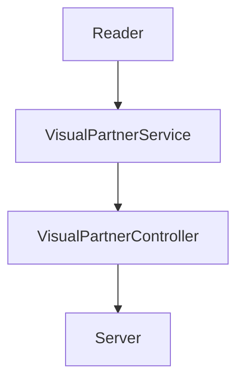

# Práctica 5 Code Challenge: Cursos de Visual Thinking API

### Requerimientos:

1. Habilitar un endpoint para consultar todos los estudiantes con todos sus campos.
2. Habilitar un endpoint para consultar los emails de todos los estudiantes que tengan certificación `haveCertification`.
3. Habilitar un endpoint para consultar todos los estudiantes que tengan `credits` mayor a 500.

### Dependencias

En esta practica se utilizaron las siguintes dependencias:

* Jest (27.5.1): Para el uso de las pruebas unitarias

```
npm install --save-dev jest
```

* Expless: Para un servidor local

```
npm install express --save
```

* ESList: Sirve para corregir errores el codigo y darle mejor calidad

```
npm install eslint --save-dev
```


### Diseño de Componentes





### Endpoint

Consulta de los resultados:

`/v1/students`


`/v1/students/emails`


`/v1/students/credits`


